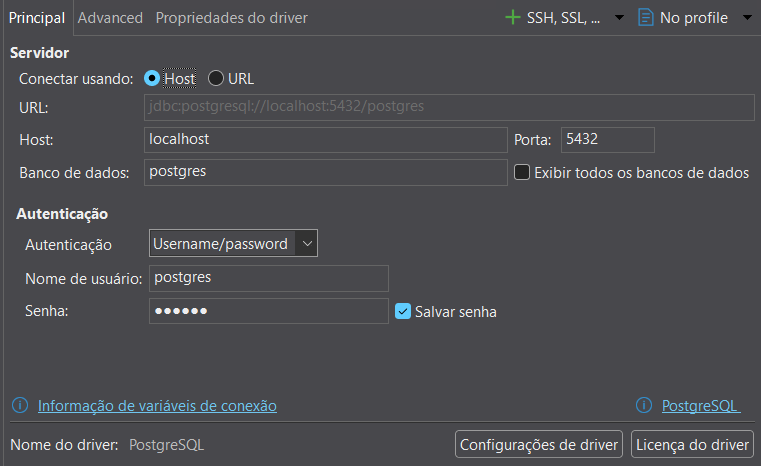
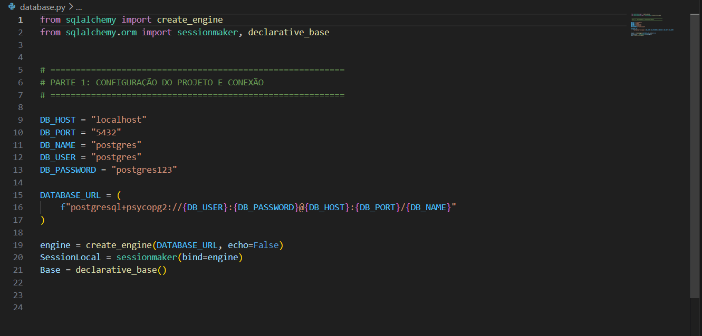
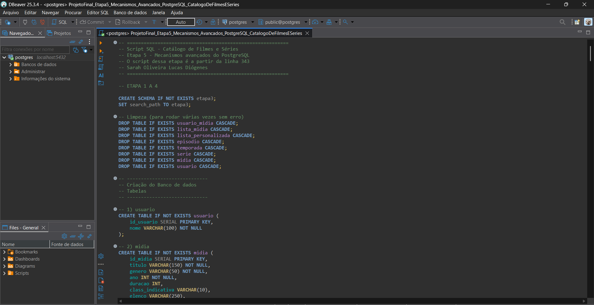
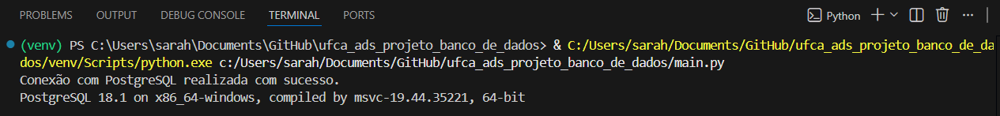
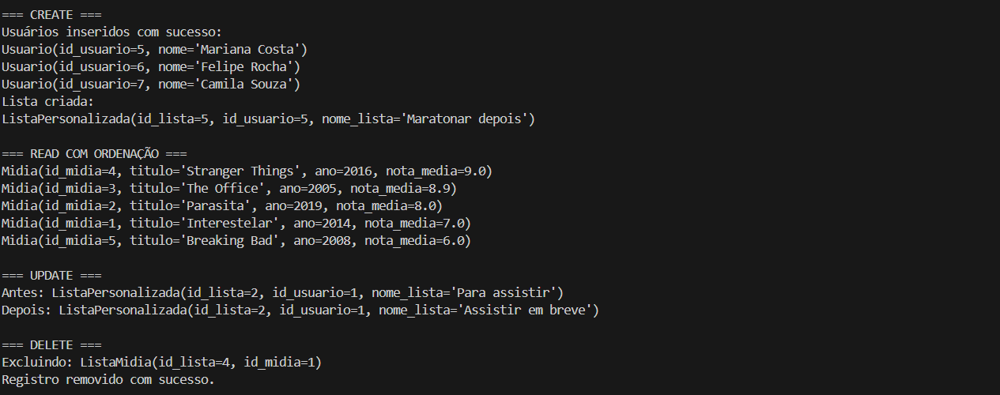
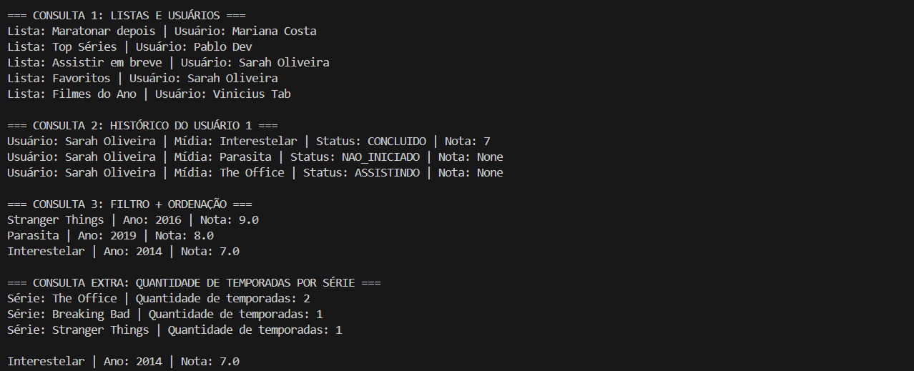
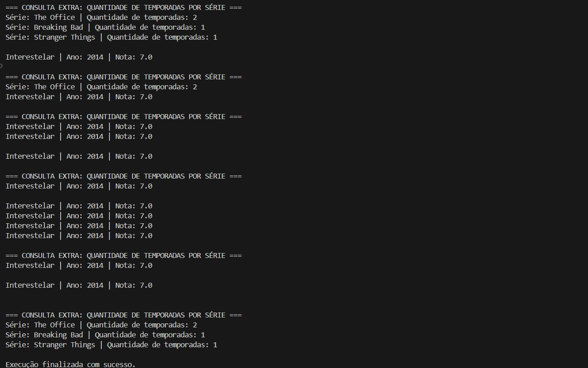
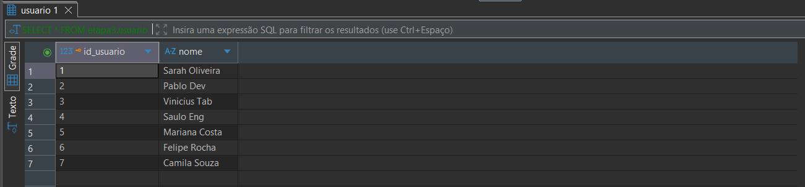

# 🎬 Catálogo de Filmes e Séries - ORM com SQLAlchemy

Este projeto implementa um sistema de gerenciamento de catálogo de filmes e séries utilizando **Python, SQLAlchemy e PostgreSQL**.

A aplicação demonstra:

- Conexão com banco de dados PostgreSQL
- Mapeamento ORM com SQLAlchemy
- Operações CRUD
- Consultas com relacionamento entre tabelas
- Consultas com agregação e ordenação

---

# Tecnologias utilizadas

- Python 3
- PostgreSQL
- SQLAlchemy
- Psycopg2
- VS Code
- DBeaver

# Estrutura do Projeto

O projeto possui os seguintes arquivos principais:

- [database.py](database.py) → configuração da conexão com o banco de dados PostgreSQL.
- [`models.py`](models.py) → definição das entidades ORM e os relacionamentos entre as tabelas.
- [`main.py`](main.py) → execução das operações CRUD e consultas 
- `Script do banco e dados de teste` → script SQL para criação do banco

# ▶️ Como executar o projeto
## 1. Abrir o projeto no VS Code.

## 2. Verificar configuração do banco

Verifique as configurações do banco: 

 

## 3. Verificar se o banco está funcionando: 

Confirme se o banco está ativo no PostgreSQL.

## 4. Criar o ambiente virtual no VS Code:
    Abrir terminal e executar: python -m venv venv

## 5. Instalar as dependências do projeto
    Execute: pip install sqlalchemy psycopg2-binary

## 6. Executar o sistema: 
python main.py

## Resultados da execução
Ao executar o programa, o sistema irá:
🔹Testar a conexão com o PostgreSQL: 

🔹Operações CRUD: 
- Inserção de usuários, leitura com ordenação, Atualização de lista, Exclusão de registro

        
🔹Consultas com relacionamento entre tabelas: 

## Verificação no banco de dados
Após executar o programa, os registros podem ser visualizados diretamente no PostgreSQL.
    

👩‍💻 Autora
Sarah Oliveira Lucas Diógenes

