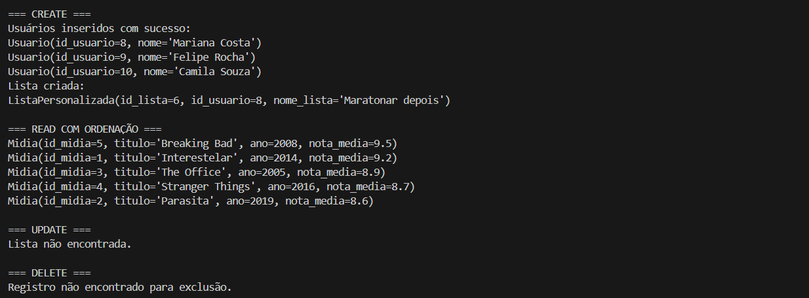
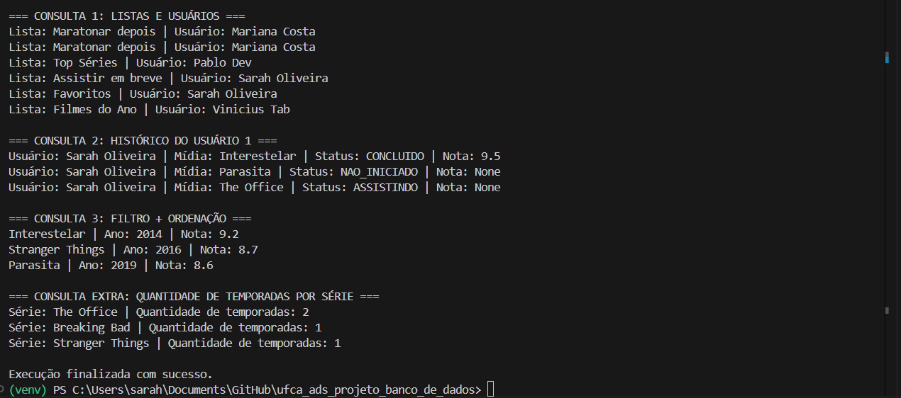
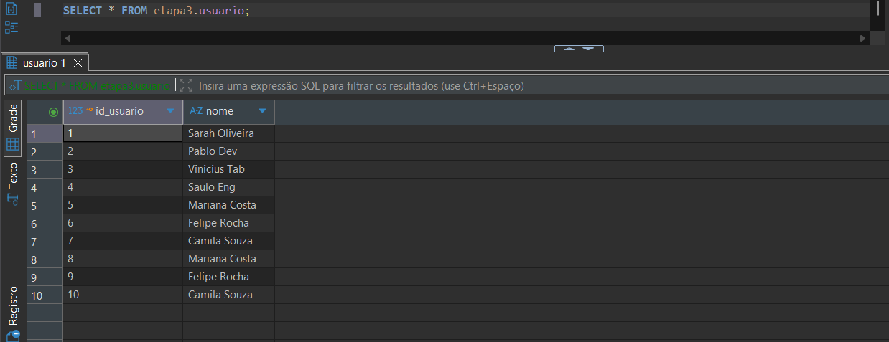

-- ==========================================================
-- Script SQL - Catálogo de Filmes e Séries
-- Etapa 7 - ORM acessando o banco criado
-- Sarah Oliveira Lucas Diógenes
-- ==========================================================
# Catálogo de Filmes e Séries - ORM com SQLAlchemy

Este projeto implementa um sistema de gerenciamento de catálogo de filmes e séries utilizando **Python, SQLAlchemy e PostgreSQL**.

A aplicação demonstra:

- Conexão com banco de dados PostgreSQL
- Mapeamento ORM com SQLAlchemy
- Operações CRUD
- Consultas com relacionamento entre tabelas
- Consultas com agregação e ordenação

# Tecnologias utilizadas

- Python 3
- PostgreSQL
- SQLAlchemy
- Psycopg2
- VS Code
- DBeaver

# Estrutura do Projeto

O projeto possui os seguintes arquivos principais:

- [database.py](database.py) → configuração da conexão com o banco de dados PostgreSQL.
- [`models.py`](models.py) → definição das entidades ORM e os relacionamentos entre as tabelas.
- [`main.py`](main.py) → execução das operações CRUD e consultas
- [text](README.md)
- [text](requeriments.txt)
- [text](<Script do Banco e Dados de teste>) -> script do banco de dados

# Como executar o projeto
1. Abra a pasta do projeto no VS Code: 
2. Verifique as configurações do banco:  
3. Verificar se o banco está funcionando: 
4. Criar o ambiente virtual no VS Code:
    Abrir terminal e executar: python -m venv venv
5. Instalar as dependências do projeto
    Dispondo do arquivo já criado (requeriments.txt)
    Executar: pip install -r requirements.txt
6. Executar o sistema: python main.py
7. Resultado da execução
    Ao executar o programa, o sistema irá:
        Testar a conexão com o PostgreSQL: 
        Inserir usuários: 
        Criar listas personalizadas: 
        Executar consultas no banco
        Exibir os resultados no terminal, como já mostrado nos prints anteriores.
8. Verificar os dados no banco
    Após executar o programa, os registros podem ser visualizados diretamente no PostgreSQL.
    

